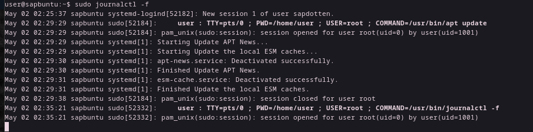
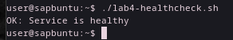
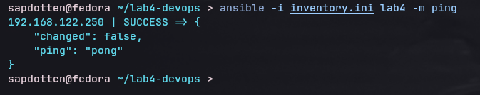

# Лабораторная работа №4

**Студент:** Семенова А.П  
**Группа** 6411

---

## 1. Среда выполнения

- **Хост:** Fedora release 42 (Adams)
- **Гипервизор:** KVM/QEMU
- **Образ:** Ubuntu Server 22.04 LTS
- **IP ВМ:** 192.168.122.250
- **Пользователь:** user

---

## 2. Задание 1. Подготовка ВМ

Установка необходимых пакетов (`git`, `curl`, `python3`, `ansible` на хосте).

**Команды на ВМ:**
```bash
sudo apt update
sudo apt install git curl python3 python3-venv -y
```

---

## 3. Задание 2. Bash-скрипт сервиса

Скрипт `service.sh` запускает HTTP-сервер на порту 8000.

**Содержимое `service.sh`:**
```bash
#!/usr/bin/env bash
set -euo pipefail

WEB_ROOT="/opt/lab4-service/html"

mkdir -p "$WEB_ROOT"

if [ ! -f "$WEB_ROOT/index.html" ]; then
    echo "<h1>СЕМЕНОВА</h1>" > "$WEB_ROOT/index.html"
fi

exec python3 -m http.server --directory "$WEB_ROOT" 8000

```

**Проверка работы:**
```bash
curl http://192.168.122.250:8000
```


---

## 4. Задание 3. systemd-юнит

Файл `lab4-service.service` для автозапуска.

**Содержимое `lab4-service.service`:**
```ini
[Unit]
Description=Lab4 Simple HTTP Service
After=network.target

[Service]
Type=simple
User=www-data
Group=www-data
WorkingDirectory=/opt/lab4-service/html
ExecStart=/opt/lab4-service/service.sh
Restart=on-failure
RestartSec=5
StandardOutput=journal
StandardError=journal

[Install]
WantedBy=multi-user.target
```

**Статус сервиса:**
```bash
systemctl status lab4-service
```


---

## 5. Задание 4. Логи и healthcheck

**Логи сервиса:**
```bash
sudo journalctl -f
```



**Скрипт `lab4-healthcheck.sh`:**
```python
#!/usr/bin/env bash
set -euo pipefail

URL="http://127.0.0.1:8000/"

if curl -s -o /dev/null -w "%{http_code}" --max-time 5 "$URL" | grep -q "200"; then
    echo "OK: Service is healthy"
    exit 0
else
    echo "FAIL: Service is down or unreachable"
    exit 1
fi
```

**Результат проверки:**
```bash
./lab4-healthcheck.sh
```



---

## 6. Задание 5. Git и публичный репозиторий

Все артефакты загружены в данный репозиторий.

---

## 7. Задания 6–8. Ansible

**Инвентарь (`inventory.example.ini`):**
```ini
[lab4]
192.168.122.250 ansible_user=user ansible_ssh_private_key_file=~/.ssh/lab_key ansible_python_interpreter=/usr/bin/python3
```

[**Playbook (`site.yml`):**](./site.yml)

**Проверка связи (`ping`):**
```bash
ansible -i inventory.ini lab4 -m ping
```



**Запуск плейбука:**
```bash
ansible-playbook -i inventory.ini site.yml
```


**Healthcheck через Ansible:**
В вывод плейбука включена задача `uri`, проверяющая статус 200.


---

## 8. Выводы

В ходе работы был автоматизирован процесс развертывания веб-сервиса.
1. Написан bash-скрипт для запуска Python HTTP-сервера.
2. Создан systemd-юнит для управления сервисом (автозапуск, рестарт).
3. Настроен healthcheck-скрипт для мониторинга доступности.
4. Все конфигурационные файлы версионированы в Git и опубликованы.
5. Написан Ansible-playbook для идемпотентного развертывания сервиса на удаленном хосте.

**Трудности:**
- Ошибка аутентификации `sudo` в Ansible (решено настройкой `NOPASSWD` в sudoers).
